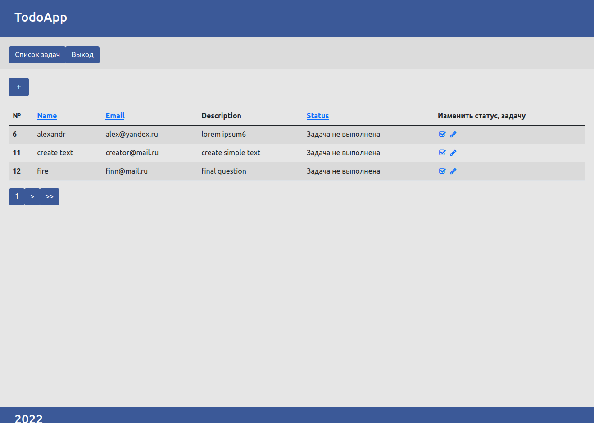
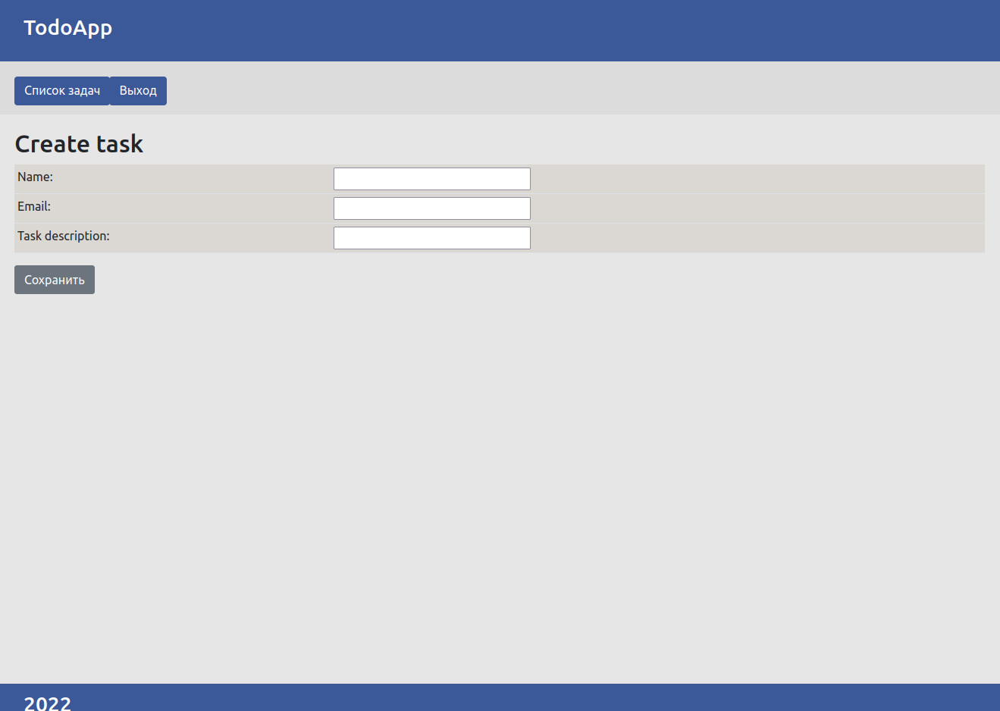

# Todolist

[-green)](/docs/requirements/)

## Task description
Task description is available [here](task.md)

## System requirements 
 - Vagrant 2.2.14 ([how to install](https://www.vagrantup.com/downloads/))
 - VirtualBox 6.1 ([how to install](https://www.virtualbox.org/))
 - Vagrant plugin - vagrant-hostsupdater ([how to install](https://github.com/agiledivider/vagrant-hostsupdater?ysclid=l4pfqhqm6q50864468))

## Installation instructions
 - ``git clone https://github.com/olesiavm/todolist``
 - ``cd todolist``
 - ``composer install``
 - run ``vagrant up``
 - go to ``https://192.168.50.5/``  

## How to stop 
 - run ``vagrant halt``

## Start one test
 - run ``vagrant ssh``
 - ``cd /var/www/html``
 - run in directory todoList ``vendor/bin/phpunit  tests/todoApp/TaskTest.php``

## Start all tests
 - run ``vagrant ssh``
 - ``cd /var/www/html/tests``
 - run in directory tests ``./start.sh  todoApp``

##

